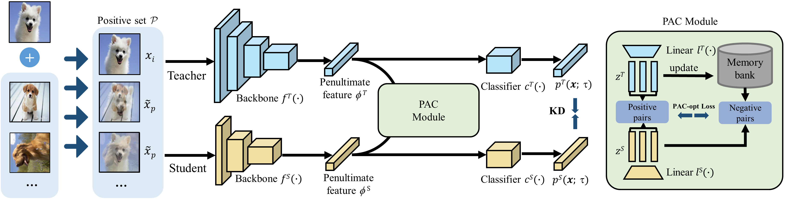

# PACKD
The official implementation of [ACMMM2022] Pay Attention to Your Positive Pairs: Positive Pair Aware Contrastive Knowledge Distillation [pdf](.github/camera-ready-mmfp2140.pdf)

# Positive pair Aware Contrastive Knowledge Distillation

### Framework & Performance

<div style="text-align:center"></div>

### Main Benchmark Results

| Teacher <br> Student |ResNet56 <br> ResNet20|ResNet110 <br> ResNet32| ResNet32x4 <br> ResNet8x4| WRN-40-2 <br> WRN-16-2| WRN-40-2 <br> WRN-40-1 | VGG13 <br> VGG8|
|:---------------:|:-----------------:|:-----------------:|:-----------------:|:------------------:|:------------------:|:--------------------:|
| Teacher | 72.75 | 74.07 | 79.55 | 76.00 | 76.00 | 74.81 |
| Student | 68.93 | 71.45 | 72.22 | 73.03 | 71.32 | 70.68 |
| KD | 71.12 | 73.08 | 73.53 | 75.47 | 73.66 | 73.14 |
| **PACKD** | **72.59** | **75.31** | **77.09** | **77.32** | **77.15** | **75.94** |


| Teacher <br> Student |ResNet32x4 <br> ShuffleNet-V1|WRN-40-2 <br> ShuffleNet-V1| ResNet32x4 <br> ShuffleNet-V2| ResNet50 <br> MobileNet-V2| ResNet50 <br> vgg8|
|:---------------:|:-----------------:|:-----------------:|:-----------------:|:------------------:|:------------------:|
| Teacher | 79.55 | 76.00 | 79.55 | 78.87 | 78.87 |
| student | 71.60 | 71.60 | 72.90 | 64.39 | 70.68 |
| KD | 74.20 | 75.69 | 74.94 | 67.83 | 73.33 |
| **PACKD** | **79.02** | **79.19** | **79.63** | **72.83** | **76.71** |

### Training on CIFAR-100

- Download the `cifar_teachers.tar` at <https://github.com/smuelpeng/PACKD/releases/tag/checkpoints> and untar it to `./save_t` via `tar xf save_t.tar`.

  ```bash
  # Training basleine.
  sh scripts/run_vanilla.sh

  # Distillation method.
  sh scripts/run_distill.sh
  ```

# Citation


# License

PACKD released under the MIT license. See [LICENSE](LICENSE) for details.

# Acknowledgement

- Thanks for CRD and ReviewKD. We build this library based on the [CRD's codebase](https://github.com/HobbitLong/RepDistiller) 
